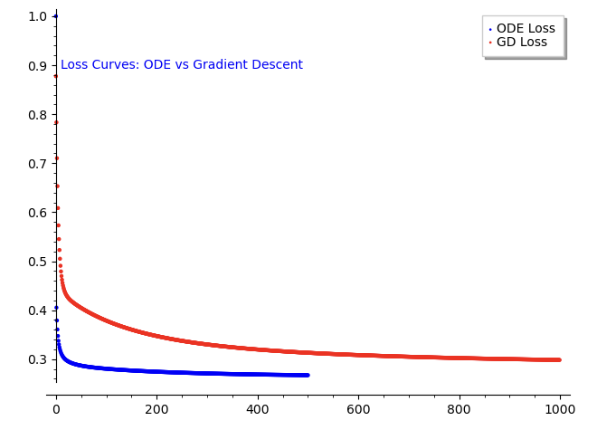

# California Housing Price Prediction Using ODE and Gradient Descent

This project aims to predict housing prices in California using two different approaches: Ordinary Differential Equations (ODE) and Gradient Descent (GD). The primary objective is to compare the performance and loss between these two methods.

## Project Overview

The project involves the following steps:
1. **Data Preparation**: Fetching and preprocessing the California housing dataset.
2. **Feature Engineering**: Adding polynomial features and standardizing them.
3. **Normalization**: Normalizing the target variable.
4. **Prediction Models**:
   - **ODE Approach**: Solving a system of ODEs to find the optimal parameters.
   - **Gradient Descent Approach**: Using gradient descent to optimize the parameters.
5. **Evaluation**: Comparing the performance and loss of both models.

## File Structure

- `housing_price_prediction.py`: The main script that performs data preprocessing, model training, and evaluation.

## Prerequisites

Make sure you have the following libraries installed:
- `numpy`
- `scipy`
- `sklearn`
- `sage`

You can install the required packages using:
```bash
pip install numpy scipy scikit-learn sage
```

Usage
-----

1.  ```bash
    python housing\_price\_prediction.py
    ```
    
2.  **View the Plots**:
    
    *   Loss Curves: ODE vs Gradient Descent
        
    *   Actual vs Predicted House Prices (ODE)
        
    *   Actual vs Predicted House Prices (GD)
  
## Results

### Loss Curves: ODE vs Gradient Descent


### Actual vs Predicted House Prices (ODE)


### Actual vs Predicted House Prices (GD)


## Conclusion

The project demonstrates the effectiveness of using ODE and Gradient Descent for predicting housing prices. The loss curves indicate the convergence behavior of both methods. While the ODE approach shows promising results with a lower final loss compared to Gradient Descent, both methods have their merits and can be chosen based on the specific requirements and computational resources available.

## License

This project is licensed under the MIT License - see the [LICENSE](LICENSE) file for details.

## Acknowledgements

- The California housing dataset is provided by the `fetch_california_housing` function from `sklearn.datasets`.
- Thanks to the open-source community for providing the tools and libraries used in this project.

